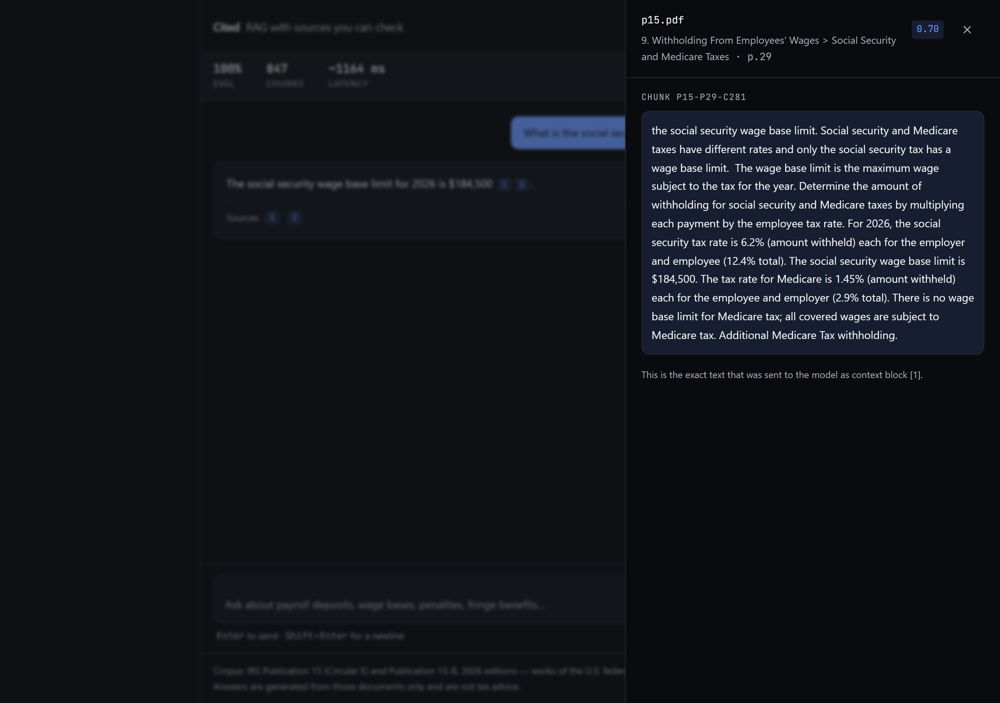

# Cited — a RAG chatbot that shows its sources and admits what it doesn't know

[](https://github.com/hashim-nadeem/rag-chatbot-citations/actions/workflows/ci.yml)

### ▶ [rag-chatbot-citations.vercel.app](https://rag-chatbot-citations.vercel.app)

Try **"What is the capital of France?"** — it refuses in ~3 ms without calling the
model at all. Then click any `[1]` to read the exact chunk the answer came from.

Ask a question about 95 pages of IRS employer tax guidance. Every factual sentence
comes back with a citation you can click open to read the exact source passage — and
a question the documents don't cover gets refused **before the model is ever called**,
not answered with a confident guess.

Retrieval is ~200 lines of hand-written TypeScript. No LangChain, no LlamaIndex, no
vector database. Total cost to build and run: **$0**.

| | |
|---|---|
|  |  |
| Suggested questions answer instantly from a precomputed file — no model call, no quota. | Clicking a `[n]` chip opens the exact chunk sent to the model, with its section path, page and similarity score. |

---

## Why this exists

Every RAG demo answers questions. Almost none publish an accuracy number, and almost
none handle "the answer isn't in here." Those two things are the product:

1. **Citations you can verify.** Not a footnote listing a filename — the actual chunk
   text that was placed in the prompt, with its similarity score. If retrieval were
   making things up, this drawer would show it.
2. **A refusal that is enforced in code.** If nothing clears the similarity floor, the
   route returns a refusal and `generateStream` is never reached. This is not a line
   in the system prompt asking the model to behave. It's a `return` statement, and it
   is the single most important behaviour in the app.

---

## Measured results

Everything below is produced by `npm run sweep` / `npm run eval` against
[`evals/questions.jsonl`](evals/questions.jsonl) — 30 questions, **25 answerable and 5
deliberately not**. The five unanswerable ones are *plausible*: things the corpus
sounds like it should cover but doesn't ("What is the California state disability
insurance withholding rate?"). Those five measure hallucination, which is what
actually matters.

### Retrieval and the guard

Deterministic and generation-free — reproduce with `npm run sweep`.

| Metric | Result |
|---|---|
| **Retrieval hit@5** | **92%** (23/25) — an expected source chunk appears in the top 5 |
| **Guard precision** | **100%** (5/5) — every off-corpus question refused without an LLM call |
| **False refusal from the guard** | **0%** (0/25) — no answerable question is starved of context |
| **Refusal latency** | **3–5 ms** — no network call happens at all |
| Corpus | 847 chunks · 2 documents · 95 pages · 6.5 MB vector store |

### Why the similarity floor is 0.68, not 0.35

This is the measurement I'd most want to be asked about. The obvious floor for a
"this is off-topic" guard is something like 0.35. For `gemini-embedding-001` that
value is **dead code** — it occupies a much narrower band of the cosine range, and on
this corpus *every* question scores above 0.60, on-topic or not. A 0.35 floor would
never reject anything, and the refusal guarantee would silently be resting on the
prompt instead.

`npm run sweep` measures the actual distributions:

| | top-1 cosine |
|---|---|
| Answerable questions | 0.701 – 0.811 |
| Unanswerable questions | 0.610 – 0.656 |

| Floor | hit@5 | starved | guarded |
|---|---|---|---|
| 0.60 | 92% | 0% | 0% |
| 0.64 | 92% | 0% | 80% |
| **0.68 (in use)** | **92%** | **0%** | **100%** |
| 0.72 | 84% | 8% | 100% |
| 0.80 | 4% | 96% | 100% |

0.68 sits in the gap with ~0.02 of clearance on each side. **That margin is thin and
it is fitted to 30 questions** — a genuinely borderline question could land inside it,
and the band moves with the corpus, the chunker and the embedding model. The sweep is
in the repo so it can be re-run rather than trusted.

### Answer quality — pending one command

`npm run eval` also measures **answer accuracy**, **citation rate** and **latency**,
which require generation. The last full run was cut short by the free tier's daily
generation limit, and the runner is deliberately built to **refuse to publish a
contaminated score**: it excludes questions that failed on provider errors, stamps
`evals/RESULTS.md` as `INCOMPLETE`, withholds `evals/results.json` (the file the stat
bar reads), and exits non-zero.

So the stat bar currently shows `—` rather than a number I can't stand behind. One
command fills it in:

```bash
npm run eval     # writes evals/RESULTS.md + results.json, lights up the stat bar
```

A real 82% is worth more than a fabricated 97%.

---

## How it works

```
corpus/*.pdf
    │  npm run embed   (build time, once)
    ▼
data/vectors.json ─────────────┐
                               │ parsed once per warm lambda
user question                  ▼
    │                    cosine top-5, floor 0.68, max 3 per source
    ├─► canned.json hit? ──► instant answer, 0 tokens
    │                             │
    │                        0 results? ──► refusal, LLM never called
    │                             │
    └───────────────────────► prompt + context ──► stream ──► answer + citations
```

1. **Chunk** — PDFs split on *real* headings. Extracted PDF text has no structure, and
   inferring headings from line shape fails badly because hard-wrapped body lines look
   exactly like headings. [`lib/pdf.ts`](lib/pdf.ts) reads font metrics from pdfjs and
   treats a line as a heading when it's set taller than the page's dominant body size.
   [`lib/chunk.ts`](lib/chunk.ts) then accumulates ~800-character chunks with 150
   characters of overlap, never splitting mid-sentence, and prefixes each chunk with
   its section path (`Calendar > By February 28`) — the heading supplies context the
   body assumes.
2. **Embed** — `npm run embed` embeds every chunk in paced batches and commits the
   result to `data/vectors.json`. Build time only, never at request time. Vectors are
   rounded to 6 decimals, which roughly halves the file with no effect on ranking.
3. **Retrieve** — cosine similarity in memory, top 5, similarity floor 0.68, at most
   3 chunks from any one document so a verbose section can't crowd out the corpus.
4. **Guard** — zero results ⇒ refusal, returned before any model call.
5. **Generate** — surviving chunks go in as numbered context blocks; the system prompt
   requires a `[n]` marker on every factual sentence, and citation metadata streams to
   the UI alongside the tokens so each marker becomes a chip that opens the real chunk.

---

## Engineering decisions

**`lib/llm.ts` is the only file that talks to a provider.** One `embed()`, one
`generateStream()`. Nothing else imports a provider SDK, URL, or model id, so swapping
to Claude or GPT is a change to that one file. It uses plain `fetch` rather than an
SDK: both APIs are a single POST, and the dependency-free version is smaller than the
wiring an SDK needs.

**No vector database.** At 847 chunks a linear scan of 768-dimension vectors is well
under a millisecond. A database here would be ceremony, not engineering. The README
says where that stops being true — see [At scale](#what-id-change-at-scale).

**The suggested questions are precomputed.** They live in `data/canned.json` and
return instantly with zero tokens, so the demo still works after the daily quota is
gone. A visitor who arrives at a dead quota sees a working product and a clear
message, not a broken one.

**The source drawer is a native `<dialog>`.** Focus trap, Escape-to-close and
inertness come from the platform instead of a dialog library.

**No component library.** The design tokens in [`app/globals.css`](app/globals.css)
*are* the design system; adding shadcn/ui would have meant maintaining a second,
parallel set of CSS variables for the three components this app actually needs.

### Four things that were wrong, and how they were found

Worth reading if you want to know how I work — each was caught by measurement, not by
guessing.

| What broke | How it surfaced | Fix |
|---|---|---|
| **Heading detection** produced garbage section paths like `Publication 15 > Backup withholding. The backup withholding rate re-`, and that text was being embedded. | 1166 fragmented chunks averaging ~410 chars against an 800 target. | Font metrics instead of line shape → **847 chunks, median 775 chars**, real sections. |
| **The similarity floor never fired.** The guard existed but could not trigger. | Sweep showed `guarded: 0%` at every floor up to 0.55. | Measured the distributions, moved the floor into the gap at 0.68 → **100% guarded**. |
| **Answers truncated mid-sentence** ("…which falls on April"). | A canned answer came back with no citation marker. | Gemini 3 charges *reasoning* tokens against `maxOutputTokens`; ~340 on a trivial prompt. Raised the budget and set `thinkingLevel: "low"`. |
| **The eval understated itself.** Provider 429s were being scored as wrong answers, reporting 84% when the pipeline hadn't failed. | Four questions showed `ERR` yet accuracy still dropped. | Errors now excluded from scoring, run marked `INCOMPLETE`, `results.json` withheld, exit 1. |

Both model ids named in the original plan (`text-embedding-004`, `gemini-2.5-flash`)
had been **retired** by build time and returned 404. They're read from env in
`lib/llm.ts` and documented in `.env.example` — verify them in your own console.

---

## What I'd change at scale

- **In-memory cosine over a committed JSON file** is correct and fast to roughly 5,000
  chunks. Past that: pgvector on Neon, or a hosted vector store.
- **No reranker.** A cross-encoder rerank of the top 20 → 5 would lift precision
  meaningfully; skipped because it needs a second model and this build is free-tier.
- **No conversational retrieval rewriting.** A follow-up like "what about part time?"
  retrieves on that literal text. Fix: a query-rewrite pass over the last two turns.
- **Fixed-size chunking.** Semantic chunking would help on less regular documents.
- **Heading detection is typographic**, so it needs a consistent type hierarchy. A
  scanned corpus would need a layout model. `npm run embed` warns when it finds none.
- **The eval set is 30 questions.** Enough to catch a broken floor, not enough for a
  confidence interval. Next step is ~200 questions and reporting variance.

---

## Running it

Needs Node 20+ and a free [Google AI Studio key](https://aistudio.google.com/apikey)
(no credit card).

```bash
npm install
cp .env.example .env.local        # add GOOGLE_GENERATIVE_AI_API_KEY
npm run embed                     # corpus/ -> data/vectors.json  (~8 min, one time)
npm run dev                       # http://localhost:3000
```

`data/vectors.json` is committed, so **you can skip `npm run embed` entirely** unless
you change the corpus or the embedding model.

| Command | What it does |
|---|---|
| `npm run dev` | Local dev server |
| `npm run build` | Production build |
| `npm test` | Unit tests for chunking and retrieval — no network, no key |
| `npm run sweep` | Similarity-floor sweep, retrieval only — no generation calls |
| `npm run eval` | Full eval suite → `evals/RESULTS.md` + `results.json` |
| `npm run eval:ollama` | Same, forced onto a local Ollama |
| `npm run embed` | Re-chunks and re-embeds `corpus/` |
| `npm run canned` | Regenerates the precomputed suggested answers |
| `npm run shots` | Regenerates `public/shots/*` with Playwright |

### Running entirely offline

```bash
ollama pull llama3.2 && ollama pull nomic-embed-text
# set LLM_PROVIDER=ollama in .env.local
npm run embed && npm run eval:ollama
```

A query embedded by one model is not comparable to a store built by another, so the
eval **aborts with a clear error** rather than reporting numbers that look plausible
and mean nothing. Switching embedding provider means re-running `npm run embed`.

### Free-tier quota

The free embedding tier limits requests *and* tokens per minute, and counts every item
inside a batch request. `npm run embed` paces itself (`EMBED_BATCH`, `EMBED_PACE_MS`)
and checkpoints to `data/.embed-cache.jsonl` after every batch, so a rate-limit stop
costs one batch rather than the whole run — re-run and it resumes. Eval question
embeddings are cached to disk, so repeat runs cost nothing and are bit-identical.

### Environment

| Variable | Required | Purpose |
|---|---|---|
| `GOOGLE_GENERATIVE_AI_API_KEY` | for Google | Embeddings and generation |
| `LLM_PROVIDER` | no (`google`) | `google` or `ollama` |
| `GOOGLE_EMBED_MODEL` / `GOOGLE_CHAT_MODEL` | no | **Verify in your console — ids get retired** |
| `GOOGLE_EMBED_DIMS` | no (`768`) | Truncates `gemini-embedding-001` from 3072 dims |
| `SIMILARITY_FLOOR` | no (`0.68`) | Re-run `npm run sweep` before changing |
| `UPSTASH_REDIS_REST_URL` / `_TOKEN` | no | Rate limiting; absent is a no-op, never a crash |
| `NEXT_PUBLIC_REPO_URL` | no | The GitHub link in the header |

---

## Project layout

```
app/api/chat/route.ts   validate → rate limit → canned → embed → retrieve → GUARD → stream
lib/llm.ts              the ONLY file that talks to a provider
lib/retrieval.ts        cosine, top-k, similarity floor, source diversity
lib/chunk.ts            chunking, shared by the embedder and the tests
lib/pdf.ts              font-metric heading detection
lib/prompt.ts           system prompt + numbered context assembly
scripts/embed.ts        build-time: corpus/ → data/vectors.json
evals/run.ts            the eval suite that produces the published numbers
components/chat/        message list, citation chips, source drawer, composer
```

---

## Deploying

Runs on Vercel Hobby, free tier, no card.

```bash
vercel link
vercel env add GOOGLE_GENERATIVE_AI_API_KEY production
vercel --prod
```

Two things about this app specifically are easy to get wrong on Vercel, and both fail
*after* a green build rather than during it:

- **`readFileSync` is invisible to the bundler.** `data/vectors.json` would be left
  out of the function bundle, and every question would 503 in production while
  working perfectly in local dev. `outputFileTracingIncludes` in
  [`next.config.ts`](next.config.ts) names the two data files explicitly; you can
  confirm they made it with
  `cat .next/server/app/api/chat/route.js.nft.json | grep vectors`.
- **The default function timeout is 10 s.** Reasoning tokens are generated before any
  visible text, so a normal answer can exceed it and the stream gets cut mid-sentence
  — intermittently, and only under load. `maxDuration = 60` is set on the route.

Rate limiting is optional but recommended for a public URL: without the Upstash pair,
`lib/ratelimit.ts` degrades to a no-op and one visitor can drain the daily free-tier
quota. The precomputed answers keep the demo alive either way.

---

## Corpus

IRS **Publication 15 (Circular E), Employer's Tax Guide** and **Publication 15-B,
Employer's Tax Guide to Fringe Benefits**, 2026 editions. Works of the U.S. federal
government, **public domain** under 17 U.S.C. § 105. Full provenance in
[`corpus/SOURCES.md`](corpus/SOURCES.md).

Chosen because the facts are specific and checkable (dollar thresholds, deadlines,
penalty schedules) and because the 2026 figures are exactly the kind of value a
general-purpose model states confidently and gets wrong — so retrieval has to do real
work.

Answers are generated from those documents only and are **not tax advice**.

## Licence

[MIT](LICENSE) for the code. The corpus is public domain and separately noted.
